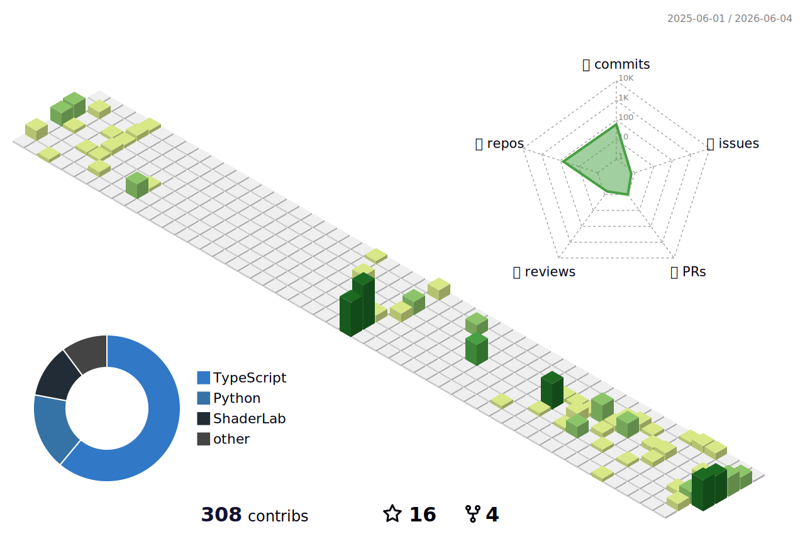
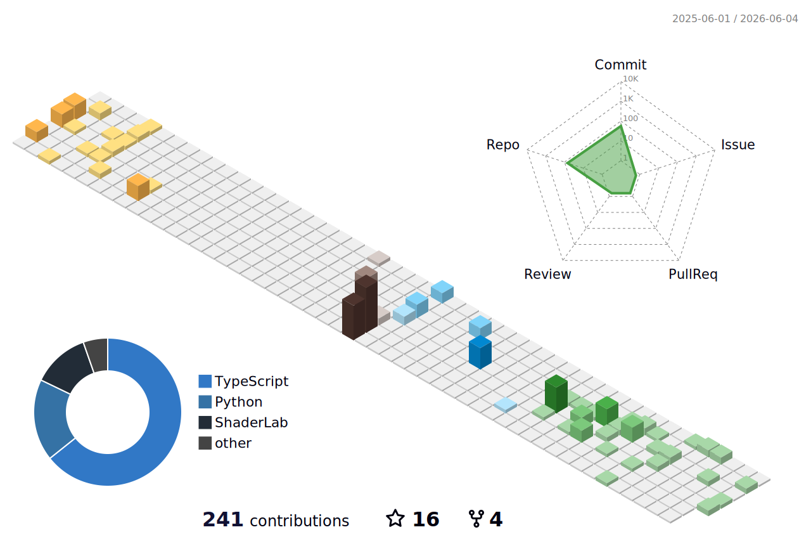
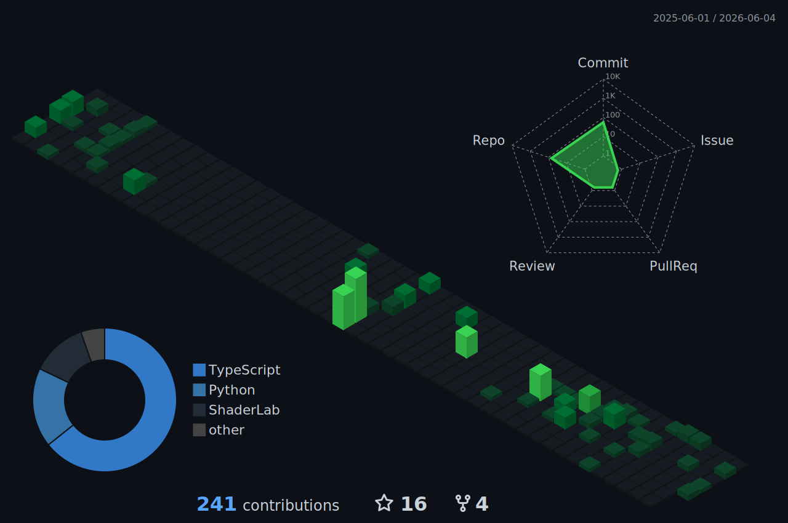
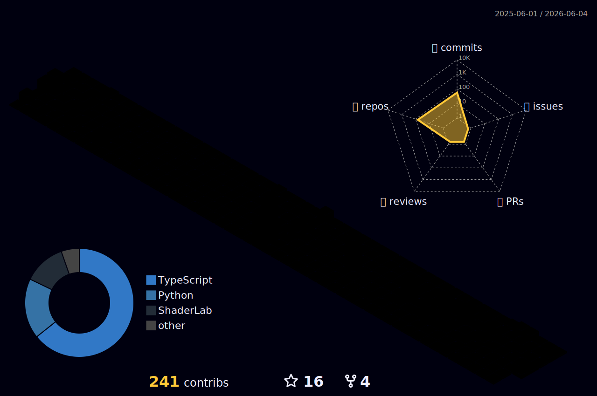

  

  

  I'm a Platform Engineer at Milliman, where I believe function is its own kind of beauty; that the cleanest systems are also the most quietly elegant. My interests span web development, artificial intelligence, creative coding, design, history, business, and human-technology interaction. I'm drawn to building practical AI solutions and to exploring how the tools we make end up shaping the way we live.

  
  

  
  
  
  
  

 

<!--
  3D activity chart hidden for now. Uncomment the block below to re-enable.
  The daily workflow at .github/workflows/profile-3d.yml continues to regenerate
  the SVGs into ./profile-3d-contrib/ regardless.

<h2 align="center">
  
</h2>

A year of contributions, rendered as a 3D contribution forest. Regenerated daily.

  

  
<b>Explore other styles</b>

   
  <table align="center">
    <tr>
      <td align="center" width="33%">
        
         <b>Season</b> — palette rotates each quarter
      </td>
      <td align="center" width="33%">
        
         <b>Night</b> — GitHub dark palette
      </td>
      <td align="center" width="33%">
        
         <b>Rainbow</b> — animated hue cycle
      </td>
    </tr>
  </table>

<i>Generated with <a href="https://github.com/yoshi389111/github-profile-3d-contrib">github-profile-3d-contrib</a></i>

-->

<!---
EGJJR/EGJJR is a special repository because its `README.md` (this file) appears on your GitHub profile.
You can click the Preview link to take a look at your changes.
--->
