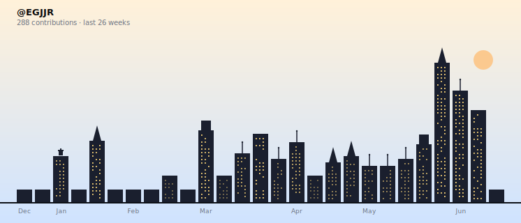

  

  

  I'm a Platform Engineer at Milliman, where I believe function is its own kind of beauty; that the cleanest systems are also the most quietly elegant. My interests span web development, artificial intelligence, creative coding, design, history, business, and human-technology interaction. I'm drawn to building practical AI solutions and to exploring how the tools we make end up shaping the way we live.

  
  

  
  
  
  

 

<!--
  Activity section. Generated by scripts/activity-chart/generate.mjs and run
  nightly by .github/workflows/profile-3d.yml over a rolling 26-week window.
  Light/dark are sibling SVGs so the <picture> swap works without JS.
-->

<h2 align="center">
  
</h2>

  <a href="https://github.com/EGJJR/EGJJR/actions/workflows/profile-3d.yml">
    <picture>
      <source media="(prefers-color-scheme: dark)" srcset="./profile-3d-contrib/skyline-dark.svg" />
      <source media="(prefers-color-scheme: light)" srcset="./profile-3d-contrib/skyline-light.svg" />
      
    </picture>
  </a>

Each building is a week. Taller means more contributions; lit windows scale with weekly intensity.

<!--
  Language card — opt-in. Uncomment the block below to display the most-used
  languages bar (generated by scripts/activity-chart/generate.mjs into
  ./profile-3d-contrib/languages-{light,dark}.svg).

  <a href="https://github.com/EGJJR?tab=repositories">
    <picture>
      <source media="(prefers-color-scheme: dark)" srcset="./profile-3d-contrib/languages-dark.svg" />
      <source media="(prefers-color-scheme: light)" srcset="./profile-3d-contrib/languages-light.svg" />
      
    </picture>
  </a>

-->

  <!-- Lightweight stats card from github-readme-stats — quieter complement to the skyline -->
  

<i>Regenerated daily — see <a href="./scripts/activity-chart/">scripts/activity-chart/</a></i>

<!---
EGJJR/EGJJR is a special repository because its `README.md` (this file) appears on your GitHub profile.
You can click the Preview link to take a look at your changes.
--->
